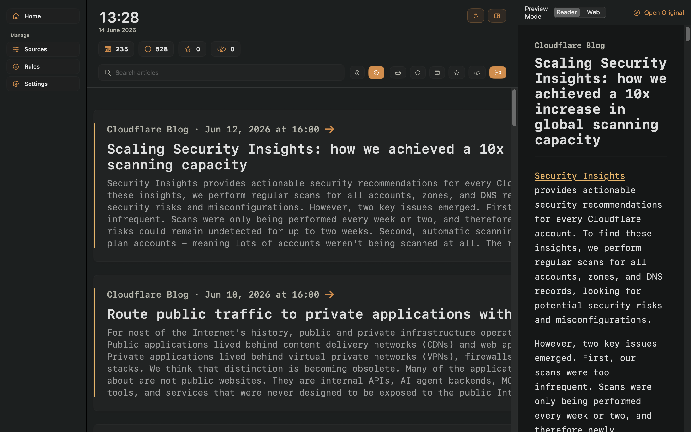
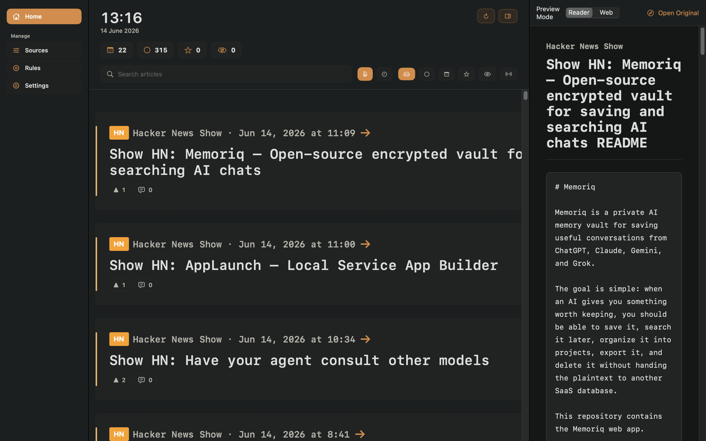
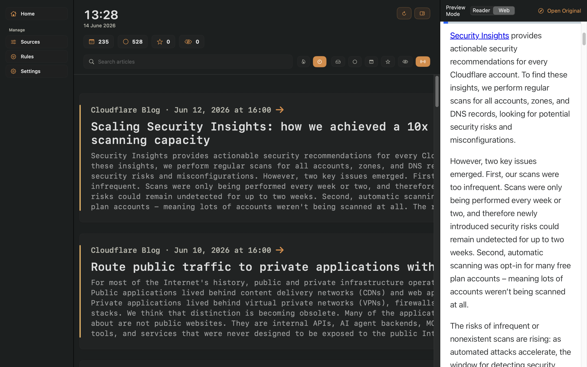

# Newsprint

## Summary

Newsprint is a local-first macOS news reader for RSS, Atom, JSON Feed, blogs, YouTube feeds, and Hacker News feeds. It is built as a native Swift app that lives in the menu bar, refreshes feeds in the background, stores articles locally with SwiftData, and gives you a newspaper-like reading surface instead of a mail-style inbox.

The app is designed for controlled personal reading:

- Choose sources explicitly.
- Keep all feed data on your Mac.
- Read in a fast, native feed with reusable AppKit-backed cards.
- Open articles in an integrated Reader/Web preview pane only when you choose.
- Apply local filtering rules to hide, star, read, boost, or tag articles.
- Import and export sources through OPML.
- Export starred articles as Markdown.
- Clean non-starred articles from Home while preserving starred items.
- Automatically clean up old unstarred articles while preserving starred items.

Newsprint is not a social feed, cloud reader, recommendation engine, or account-based sync product. It is a personal, local, tunable reader for technical news and blogs.

## Screenshots

### Cloudflare Engineering Article in Reader Mode



### GitHub Repository in Reader Mode



### Web Preview Mode



## Current Capabilities

### Sources

Newsprint supports:

- Direct RSS feed URLs.
- Atom feeds.
- JSON Feed.
- Homepage/blog feed discovery.
- YouTube channel feeds by channel ID or feed URL.
- Hacker News feeds through a dedicated source builder using HN page discovery where needed and official Firebase item metadata.
- Preset technical sources from the local catalog.
- OPML import and export.

Source records keep fetch metadata:

- Last fetch time.
- Last successful fetch time.
- Last error message.
- ETag.
- Last-Modified.
- Enabled/disabled state.
- Category.

The Sources screen uses one unified table for presets and added sources:

- Presets show a `+` action when they are not installed.
- Added presets and custom sources show a trash action.
- Command-click and Shift-click can select multiple rows for batch add/remove.
- Added sources can still be edited, refreshed, paused, or deleted from row actions and context menus.
- Health is shown as `Healthy`, `Unhealthy`, or `Dead` based on recent refresh results.

### Hacker News

Hacker News is handled as a first-class source type. Front Page, Newest, Best, Ask HN, and Jobs use official Firebase list endpoints. Show HN uses `news.ycombinator.com/shownew` for newest-order discovery, then fetches each item from the official Firebase item endpoint for structured metadata.

The HN source builder can create feeds for:

- Front Page
- Newest
- Best
- Show HN
- Ask HN
- Jobs

It also supports tuning:

- Minimum points.
- Minimum comments.
- Item count.

Existing legacy HNRSS and Firebase Show HN source URLs can be interpreted as configuration, but refreshes do not use HNRSS.

HN articles get special treatment in the feed:

- HN badge.
- Point and comment indicators.
- HN thread action.
- HN metadata parsing.
- Author/comment block handling when available.

### Feed Reading

The Home view is a two-pane workspace:

- Left: sidebar for Home, Sources, Rules, and Settings.
- Main: newspaper-style feed cards.
- Optional right: preview pane, opened explicitly.

The feed uses:

- A pinned control header with clock, counts, search, sorting, and filter chips.
- Hot/Newest sort modes.
- Inbox, Unread, Today, Starred, Hidden filters.
- Source, tag, HN-only, and Non-HN filters.
- Large expandable article cards.
- One expanded card at a time.
- Context menus and inline article actions.
- Four-line expanded text previews with a Read More control for longer text.

Article actions include:

- Mark read/unread.
- Star/unstar.
- Hide/unhide.
- Open original.
- Open HN thread when available.
- Copy link.
- Open in side preview.
- Clean Home, which removes all non-starred articles.

### Reader and Web Preview

Newsprint has a right-side preview pane that is hidden by default and opened per article.

Preview modes:

- **Reader Mode** renders local, sanitized article HTML in Newsprint's own typography and theme.
- **Web Mode** uses `WKWebView` for full web pages and interactive content.

Reader Mode behavior:

- Uses local RSS content first when the feed already provides substantial article text.
- Fetches and extracts readable HTML only when needed.
- Preserves paragraphs, headings, lists, blockquotes, images, code, and preformatted blocks.
- Strips scripts, unsafe links, event handlers, forms, iframes, and common page chrome.
- Opens links externally instead of navigating inside the Reader document.
- Handles GitHub repository URLs by preferring README content.

Web Mode behavior:

- Uses WebKit.
- Uses Newsprint's own persistent WebKit data store.
- Does not inherit Safari, Chrome, or third-party browser extensions.
- Supports configurable horizontal padding.
- Uses a lightweight curated WebKit content blocker.

### Rules

Rules are local and run before new articles are inserted.

Rule actions:

- Hide.
- Star.
- Mark read.
- Boost score.
- Tag.

Rule targets:

- Title.
- URL.
- Author.
- Source.
- Content.

Rule behavior:

- Rules have priorities.
- Enabled rules are applied in priority order.
- Rule changes apply to newly fetched articles.
- Existing articles keep their current manual state unless you clean Home and fetch them again.

### Search and Filtering

Search currently runs in memory over the loaded candidate set.

Search fields:

- Title.
- Source title.
- Author.
- Excerpt.
- Content text.
- URL.
- Tags.

Filters:

- Inbox.
- Unread.
- Today.
- Starred.
- Hidden.
- HN-only / Non-HN family.
- Source.
- Tag.

Sorting:

- **Hot**: score, then published date, then fetched date.
- **Newest**: published date, then fetched date, then score.

`Hot` and `Newest` are global display orders. HN and Non-HN are source-family filters, not separate ranking modes.

### Data Ownership

Newsprint is local-first.

The app supports:

- OPML import preview.
- OPML import with duplicate skipping.
- OPML export with source categories.
- Starred article export as Markdown.
- Local database path display.
- Delete all local data.

The default SwiftData store path is:

```text
~/Library/Application Support/newsprint/newsprint.store
```

### Retention

Default retention:

- Keep unstarred articles for 7 days.
- Never delete starred articles automatically.

Retention cleanup runs:

- After refresh.
- When retention settings change.
- When manually triggered from Settings.

### Appearance

Settings include:

- Theme.
- Feed font.
- Feed font size.
- Feed card size.
- Web preview padding.
- Menu bar icon.

Themes:

- System.
- Newsprint Light.
- Ink Dark.
- Sepia.

Feed card sizes:

- Compact.
- Comfortable.
- Newspaper.

Menu bar icon choices:

- Newspaper.
- Terminal.
- Stack.
- Signal.

The menu bar icon is dynamic:

- Refreshing uses `arrow.clockwise`.
- Normal state uses the selected icon.
- Source-level failures stay in Sources health/status instead of changing the menu bar icon to an error state.

## Architecture

Newsprint is split into two SwiftPM targets:

```text
newsprint
├── newsprintCore  # Models, services, repositories, utilities
└── newsprint      # macOS app, SwiftUI/AppKit UI, menu bar agent
```

### Core Target

`newsprintCore` contains the testable application logic:

```text
Sources/newsprintCore
├── Models
├── Services
├── Storage
└── Utilities
```

Important model types:

- `Source`
- `Article`
- `ArticleDraft`
- `AppSettings`
- `FilterRule`
- `PresetSource`
- `HackerNewsFeedConfiguration`

Important services:

- `FeedHTTPClient`
- `FeedParser`
- `HackerNewsAPIClient`
- `FeedDiscoveryService`
- `FeedRefreshActor`
- `ArticleFeedReadActor`
- `FeedRefreshApplicationPolicy`
- `RuleEngine`
- `RetentionEngine`
- `ArticleSearchService`
- `ReadableArticleFetcher`
- `ReadableArticleExtractor`
- `OPMLImporter`
- `OPMLExporter`
- `StarredArticleExporter`

Important storage helpers:

- `SettingsRepository`
- `SwiftDataSourceRepository`
- `SwiftDataArticleRepository`
- `SwiftDataArticleFeedRepository`
- `SwiftDataRuleRepository`
- `DataOwnershipRepository`

Important utilities:

- `URLCanonicalizer`
- `ArticleIDGenerator`
- `ArticleRenderWindow`
- `DateParser`
- `HTMLTextExtractor`
- `HackerNewsMetadata`
- `NewsprintLog`
- `StartupTimingRecorder`

### App Target

`newsprint` contains the macOS UI and menu bar agent:

```text
Sources/newsprint
├── NewsprintApp.swift
├── NewsprintAgentController.swift
└── Views
```

Key UI pieces:

- `RootView`
- `SidebarView`
- `ArticleFeedView`
- `ArticleFeedCollectionView`
- `ArticleFeedCard`
- `ArticlePreviewPane`
- `ReaderHTMLPreviewView`
- `ArticleWebPreviewView`
- `SourcesView`
- `RulesView`
- `SettingsView`

### Data Flow

RSS, Atom, JSON Feed, YouTube, and discovered blog feeds use the generic feed path:

```text
Source
  ↓
FeedHTTPClient
  ↓
FeedParser
  ↓
ArticleDraft
  ↓
RuleEngine
  ↓
SwiftDataArticleRepository
  ↓
ArticleFeedStore
  ↓
ArticleFeedCollectionView
```

Hacker News sources use a hybrid HN path:

```text
Hacker News Source
  ↓
shownew page discovery for Show HN, Firebase lists for other HN feeds
  ↓
HackerNewsAPIClient
  ↓
ArticleDraft
  ↓
RuleEngine
  ↓
SwiftDataArticleRepository
  ↓
ArticleFeedStore
  ↓
ArticleFeedCollectionView
```

The UI does not parse feeds or write articles directly. Views call view models, repositories, or services.

## Menu Bar Agent

Newsprint is packaged as an `LSUIElement` menu bar app.

Cold boot behavior:

- Shows a menu bar item.
- Opens the dashboard window automatically.
- Shows a Dock icon while the dashboard is open.
- Hides the Dock icon after the dashboard window is closed.

Menu actions:

- Open Newsprint.
- Refresh Feeds.
- Show last refresh status.
- Show background refresh interval.
- Quit Newsprint.

Dashboard behavior:

- Opens on launch and can be reopened from the menu bar.
- Uses an instant maximized window instead of native macOS full-screen animation.
- Closing the dashboard hides it instead of quitting the app.
- Background refresh continues while the dashboard is closed.

Default background refresh interval:

```text
60 minutes
```

## Optimization Notes

Newsprint is tuned around a simple rule: the main thread should mostly render already-prepared rows. Existing local articles are shown first; network refresh, variant cache warmup, tag loading, and heavier article detail work run after the visible feed is usable.

The Home feed uses an AppKit-backed `NSCollectionView` instead of a plain SwiftUI `ScrollView`. That gives the app real row reuse, predictable scrolling, and fixed-height card layout. The feed keeps a page of article rows in memory, but only hands a 50/50/50 render window, about 150 rows, to the collection view at a time.

Feed rows are lightweight snapshots. They contain the title, source, dates, flags, scores, URLs, tags, metadata text, and short preview needed to draw a card. Full `contentHTML`, long body text, and expanded article detail live in a separate detail cache, so the same article body is not duplicated across `All`, `HN`, `Non-HN`, `Hot`, `Newest`, and `Starred` variants.

The first visible variant is loaded first. Other feed variants are warmed in the background one by one, not as one giant startup job. Switching between `Hot` / `Newest`, `All` / `HN` / `Non-HN`, and `Starred` uses warmed in-memory variants when available; if a variant is missing, Newsprint builds just that variant and swaps it in after a short loading state.

Collapsed cards use fixed heights, so scrolling does not require measuring every article. Expanded content is the only case that needs dynamic sizing, and expanded detail is cached by article ID. This keeps normal scrolling cheap while still allowing richer expanded cards.

Feed reads, refresh work, and cache preparation are pushed off the UI path through actor-backed services. The UI-facing store publishes compact state: counts, loading flags, the active query, and the current render window. Counts and tags are fetched separately, and tag loading is deferred because it is useful navigation data, not first-paint data.

Refresh is staged. Healthy sources use a 4-second fast lane, degraded sources retry in a 16-second recovery lane, and dead sources are skipped during automatic refresh until explicitly refreshed. While fetching, the current feed stays visible and the header shows source progress. The loading animation is reserved for final feed preparation and cache swapping.

Background and recovery refreshes do not reorder the feed while you are reading. They prepare a pending update and show a quiet `N articles ready` affordance. Applying that update swaps in already-prepared rows instead of doing network or cache work at click time.

Persistence is batched during refresh. Existing article IDs are checked in groups, new articles are inserted in batches, and SwiftData is saved once per batch path instead of once per article. The visible feed reloads once after bulk data changes.

Hacker News is optimized separately because it is not a normal RSS feed. Show HN uses `news.ycombinator.com/shownew` for newest-order discovery, then fetches structured item metadata from the official Firebase item endpoint. Item requests are bounded so one slow HN item cannot stall the whole refresh.

Sources management avoids feed work. Adding or removing presets updates cached source display rows locally and does not refresh articles. The Sources table uses precomputed row models so scrolling and tab-like interactions do not repeatedly sort, canonicalize, or rebuild source metadata in the view body.

Search is debounced so typing does not force a database/filter pass on every keystroke. Newsprint waits briefly for typing to pause, then refreshes the visible result set.

The app also uses a resident menu bar agent model. The cached dashboard opens into an instant maximized window, background refresh can continue while the dashboard is hidden, and startup timing logs are available through macOS unified logging.

Startup log stream:

```sh
log stream --predicate 'subsystem == "Newsprint" && category == "startup"' --info
```

## Build and Run

### Requirements

- macOS 14 or newer.
- Swift 6.1 toolchain.

### Install with Homebrew

```sh
brew tap ata-sesli/newsprint
brew trust --tap ata-sesli/newsprint
brew install --cask newsprint
```

Homebrew requires explicit trust for non-official taps before it loads their casks. The trust step is separate from macOS Gatekeeper/quarantine handling.

Upgrade:

```sh
brew upgrade --cask newsprint
```

Uninstall:

```sh
brew uninstall --cask newsprint
```

Remove the app and local Newsprint data:

```sh
brew uninstall --cask --zap newsprint
```

### Run Tests

```sh
env CLANG_MODULE_CACHE_PATH=/private/tmp/newsprint-clang-cache \
SWIFTPM_MODULECACHE_OVERRIDE=/private/tmp/newsprint-module-cache \
swift test --scratch-path /private/tmp/newsprint-swiftpm-cache
```

### Run from SwiftPM

```sh
swift run newsprint
```

### Build Release App Bundle

```sh
scripts/build-release-app.sh
```

The release app bundle is written to:

```text
dist/Newsprint.app
```

The release script:

- Builds the executable.
- Creates the `.app` bundle.
- Adds `LSUIElement`.
- Adds the app icon.
- Signs the local app bundle.

### Publish a Release

After the Homebrew tap repo exists, publish a new local-built release with:

```sh
scripts/publish-release.sh 1.0.1
```

This builds the app, zips it, updates the cask version and checksum, tags the current release commit, creates the GitHub Release with `gh`, uploads the zip, and pushes the updated cask to the tap repo.

## Project Layout

```text
.
├── Assets
├── Sources
│   ├── newsprint
│   └── newsprintCore
├── Tests
│   └── newsprintTests
├── scripts
│   ├── build-release-app.sh
│   ├── package-release.sh
│   └── publish-release.sh
├── packaging
│   └── homebrew
├── Package.swift
├── rss-plan.md
├── rss-completion-report.md
└── README.md
```

## Testing Coverage

The test suite covers:

- Feed parsing for RSS, Atom, and JSON Feed.
- Feed discovery.
- URL canonicalization.
- Article ID generation.
- HTML text extraction.
- HN metadata parsing.
- Hacker News URL building, Show HN `shownew` discovery, Firebase item mapping, and legacy HNRSS source parsing.
- Hacker News API mapping and refresh behavior.
- Source health and staged refresh behavior.
- Rule engine behavior.
- Retention cleanup.
- Article repositories.
- Source repositories.
- Paged feed repository behavior.
- Feed snapshot/window behavior.
- Feed sort cache behavior.
- Search and filtering.
- OPML import/export.
- Starred Markdown export.
- Reader extraction and sanitization.
- Web content blocker JSON shape.
- Appearance settings.
- Menu bar icon fallback and dynamic state.
- Startup timing recorder.

## Design Principles

Newsprint is built around a few constraints:

- Local-first by default.
- Explicit user-selected sources.
- No cloud account.
- No recommendation feed.
- No server dependency.
- Fast feed browsing.
- Native macOS behavior.
- Reader Mode before Web Mode.
- User ownership of source lists and exported data.

## Non-Goals

Newsprint currently does not implement:

- Account sync.
- iCloud sync.
- Mobile apps.
- Server-side feed fetching.
- Recommendation ranking.
- Social features.
- Full-text search index.
- External YouTube API lookup.
- Browser extension or Safari/Chrome profile sharing.
